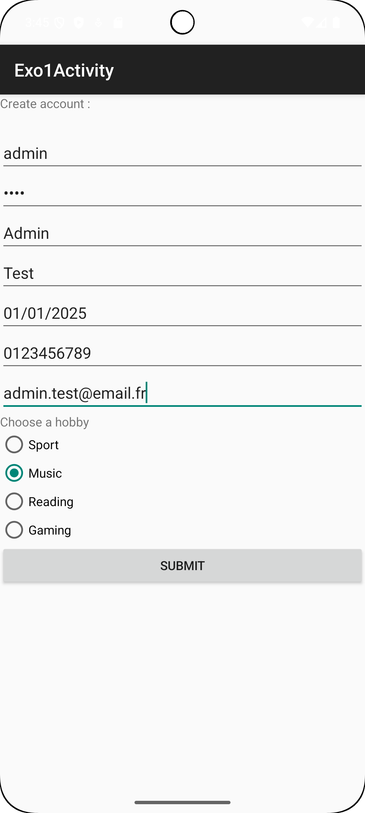
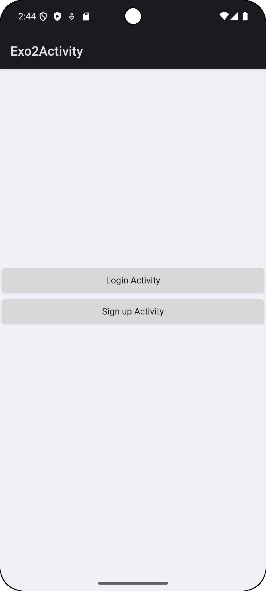
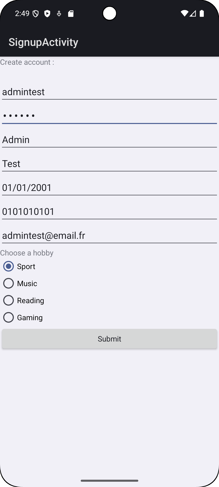
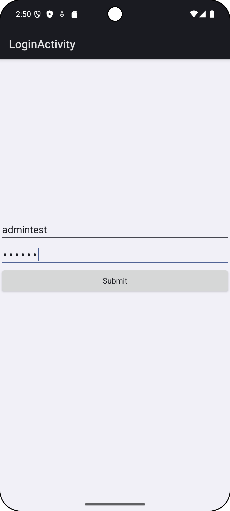
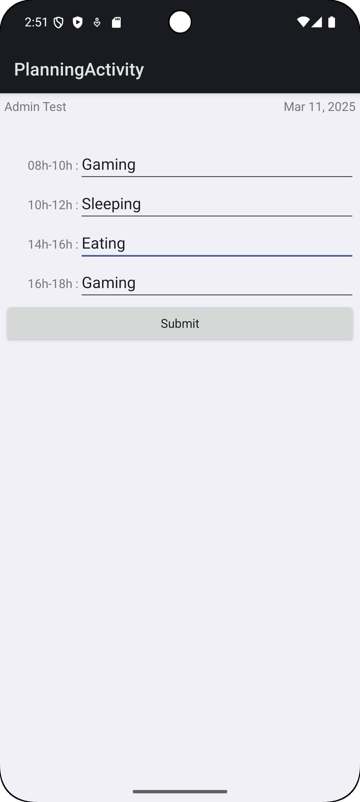
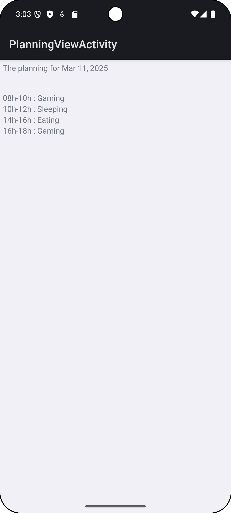

# TP3 : Base de données 

Hugo SILIVERI

Lien du Git : https://github.com/HugoSiliveri/tp3-mobile

### Environnement

- Minimum SDK : API 24 (Nougat)
- Appareil virtuel utilisé : Pixel 8 API 35 (Android 15)
- Appareil physique utilisé : Samsung S20 API 33 (Android 13)

### Description des fichiers

- `MainActivity.kt` : Activité principale de l'application (page d'accueil pour accéder aux autres activités)
- `Exo1Activity.kt` : Activité contenant les fragments (exercice 1)
- `Exo1Fragment.kt` : Fragment du formulaire (exercice 1)
- `Exo1FragmentResult.kt` : Fragment du résultat du formulaire (exercice 1)
- `Exo2Activity.kt` : Activité contenant les fragments (exercice 2)
- `LoginActivity.kt` : Activité de la page de connexion (exercice 2)
- `SignupActivity.kt` : Activité de la page d'inscription (exercice 2)
- `PlanningActivity.kt` : Activité du formulaire pour le planning du jour (exercice 2)
- `PlanningViewActivity.kt` : Activité pour visualiser le planning du jour (exercice 2)

### Exercice 1

### Exercice 2

